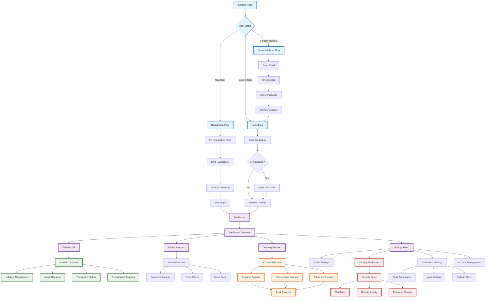

# CryptoTracker MVP - User Journey Workflow

## 🗺️ Complete User Journey Map



## 🎯 Detailed User Journey Workflows

### 1. 🔐 Authentication Journey

#### New User Registration
```
┌─────────────┐    ┌─────────────┐    ┌─────────────┐    ┌─────────────┐
│ Landing     │ →  │ Registration│ →  │ Email       │ →  │ Dashboard   │
│ Page        │    │ Form        │    │ Verification│    │ Welcome     │
└─────────────┘    └─────────────┘    └─────────────┘    └─────────────┘
  "Get Started"       Fill Details     Check Email &      Auto Login +
                                      Click Link         Onboarding
```

#### Returning User Login
```
┌─────────────┐    ┌─────────────┐    ┌─────────────┐    ┌─────────────┐
│ Landing     │ →  │ Login Form  │ →  │ 2FA Code    │ →  │ Dashboard   │
│ Page        │    │             │    │ (if enabled)│    │ Main        │
└─────────────┘    └─────────────┘    └─────────────┘    └─────────────┘
  "Sign In"          Email/Password    TOTP/Backup       Welcome Back
```

#### Password Recovery
```
┌─────────────┐    ┌─────────────┐    ┌─────────────┐    ┌─────────────┐
│ Forgot      │ →  │ Email Sent  │ →  │ Reset Form  │ →  │ Login Page  │
│ Password    │    │ Message     │    │             │    │             │
└─────────────┘    └─────────────┘    └─────────────┘    └─────────────┘
  Enter Email        Check Inbox       New Password      "Try Again"
```

### 2. 💼 Portfolio Management Journey

#### First-Time Portfolio Setup
```
┌─────────────┐    ┌─────────────┐    ┌─────────────┐    ┌─────────────┐
│ Dashboard   │ →  │ Add First   │ →  │ Asset       │ →  │ Portfolio   │
│ Empty State │    │ Asset       │    │ Details     │    │ Dashboard   │
└─────────────┘    └─────────────┘    └─────────────┘    └─────────────┘
  "Add Portfolio"    Search Crypto     Amount/Price      Live Tracking
```

#### Portfolio Monitoring
```
┌─────────────┐    ┌─────────────┐    ┌─────────────┐
│ Portfolio   │ →  │ Holdings    │ →  │ Performance │
│ Overview    │    │ Detail      │    │ Analytics   │
└─────────────┘    └─────────────┘    └─────────────┘
  Total Value        Individual        Charts & Metrics
  24h Change         Assets
```

### 3. 🔒 Security Dashboard Journey

#### Security Score Improvement
```
┌─────────────┐    ┌─────────────┐    ┌─────────────┐    ┌─────────────┐
│ Security    │ →  │ 2FA Setup   │ →  │ QR Code     │ →  │ Backup      │
│ Score: 30%  │    │ Wizard      │    │ Scan        │    │ Codes       │
└─────────────┘    └─────────────┘    └─────────────┘    └─────────────┘
  "Improve Score"    Start Setup       Authenticator     Save Codes
                                      App
                                      
                                      ┌─────────────┐
                                   → │ Score: 100% │
                                      └─────────────┘
                                      Security Complete
```

#### Security Activity Monitoring
```
┌─────────────┐    ┌─────────────┐    ┌─────────────┐
│ Login       │ →  │ Activity    │ →  │ Alert       │
│ History     │    │ Review      │    │ Setup       │
└─────────────┘    └─────────────┘    └─────────────┘
  Recent Logins     Suspicious         Email/SMS
  IP Tracking       Activity           Notifications
```

### 4. 📚 Learning Platform Journey

#### Educational Progress
```
┌─────────────┐    ┌─────────────┐    ┌─────────────┐    ┌─────────────┐
│ Course      │ →  │ Beginner    │ →  │ Lesson      │ →  │ Progress    │
│ Catalog     │    │ Track       │    │ Content     │    │ Tracking    │
└─────────────┘    └─────────────┘    └─────────────┘    └─────────────┘
  Browse Topics     Select Level       Videos/Articles   Completion %
```

#### Learning Path
```
Beginner → Intermediate → Advanced
    ↓           ↓            ↓
Crypto Basics  Technical    DeFi &
Wallets        Analysis     Yield
Trading        Portfolio    Advanced
               Management   Trading
```

### 5. 📊 Market Analysis Journey

#### Market Research Flow
```
┌─────────────┐    ┌─────────────┐    ┌─────────────┐    ┌─────────────┐
│ Market      │ →  │ Sentiment   │ →  │ News        │ →  │ Investment  │
│ Overview    │    │ Analysis    │    │ Analysis    │    │ Decision    │
└─────────────┘    └─────────────┘    └─────────────┘    └─────────────┘
  Price Trends      Social Media      Latest News       Buy/Sell/Hold
  Volume Data       Indicators        Market Impact
```

### 6. 🔔 Notification & Alert Journey

#### Alert Setup
```
┌─────────────┐    ┌─────────────┐    ┌─────────────┐    ┌─────────────┐
│ Price Alert │ →  │ Threshold   │ →  │ Delivery    │ →  │ Alert       │
│ Setup       │    │ Setting     │    │ Method      │    │ Triggered   │
└─────────────┘    └─────────────┘    └─────────────┘    └─────────────┘
  Select Asset      Set Price/       Email/SMS/Push     Notification
                    Percentage                          Sent
```

## 🚀 User Flow Optimization Areas

### Critical Path Analysis
```
🔴 Critical Paths (Must be smooth):
1. Registration → Email Verification → First Login
2. Login → Dashboard → Portfolio View
3. Add Asset → Portfolio Update → Live Tracking
4. Security Setup → 2FA Enable → Score Update

🟡 Important Paths (Should be optimized):
1. Market Analysis → Investment Decision → Portfolio Update
2. Learning Content → Progress Tracking → Skill Development
3. Alert Setup → Notification Delivery → Action Taken

🟢 Nice-to-Have Paths (Can be improved later):
1. News Reading → Social Sharing → Community Engagement
2. Advanced Analytics → Export Data → External Analysis
```

### Drop-off Prevention Points
```
⚠️ High-Risk Drop-off Points:
1. Email Verification (24-48 hour delay)
2. 2FA Setup (complexity barrier)
3. First Asset Addition (learning curve)
4. Portfolio Value Watching (engagement)

✅ Retention Strategies:
1. Reminder emails for verification
2. Progressive 2FA with rewards
3. Guided asset addition tutorial
4. Gamified portfolio tracking
```

## 📱 Mobile-First Journey Considerations

### Mobile-Optimized Flows
```
┌─────────────┐    ┌─────────────┐    ┌─────────────┐
│ Touch-First │ →  │ Gesture     │ →  │ Quick       │
│ Interface   │    │ Navigation  │    │ Actions     │
└─────────────┘    └─────────────┘    └─────────────┘
  Large Buttons      Swipe/Tap         One-Tap
  Thumb-Friendly     Shortcuts         Portfolio
```

### Responsive Breakpoints
- **Mobile**: 320px - 768px (Touch-first)
- **Tablet**: 768px - 1024px (Hybrid)
- **Desktop**: 1024px+ (Mouse-first)

## 🎯 Success Metrics by Journey

### Authentication Success
- **Registration Completion**: >85%
- **Email Verification**: >90%
- **First Login**: >95%
- **2FA Setup**: >60%

### Portfolio Engagement
- **First Asset Added**: >80%
- **Daily Portfolio Checks**: >70%
- **Portfolio Updates**: >50%
- **Alert Setup**: >40%

### Learning Engagement
- **Course Started**: >60%
- **Lesson Completed**: >40%
- **Course Completed**: >25%
- **Progress Tracking**: >80%

### Security Adoption
- **2FA Enabled**: >60%
- **Security Score >70%**: >50%
- **Login Anomaly Response**: >90%

## 🔄 Continuous Improvement

### User Feedback Integration
```
User Research → Journey Mapping → A/B Testing → Implementation
     ↑                                              ↓
Analytics Review ←  Performance Monitoring ←  User Behavior
```

### Journey Optimization Pipeline
1. **Identify friction points** from analytics
2. **Prototype improvements** with user testing
3. **A/B test changes** with feature flags
4. **Deploy optimized flows** based on results
5. **Monitor impact** on key metrics

This comprehensive user journey workflow ensures a smooth, secure, and engaging experience for CryptoTracker MVP users while maintaining focus on core portfolio tracking and educational value delivery.